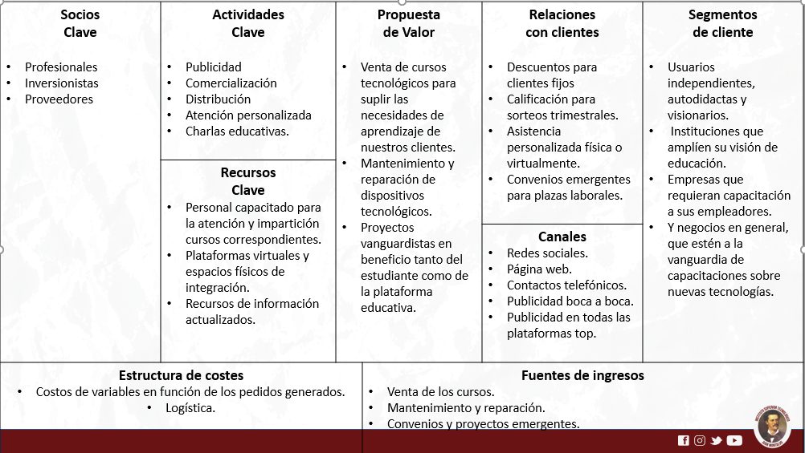

# Modelo Canva

## Objetivos

### Objetivo General

* Emplear el modelo canva para estructurar un tipo de negocio.

### Objetivos Específicos

* Analizar los aspectos importantes acerca del modelo canva y definir sus usos.

* Elaborar paso a paso el modelo canva y crear un entorno virtual para poder subirlo a la plataforma GitHud.

## Introducción

El futuro nos pone ansiosos frente a la problemática del desempleo que surge día a día porque a la humanidad le toco pasar en estos últimos años por una crisis sanitaria denominada __pandemia__, que no solo atentó con la vida humana de muchos, sino que, también, con la de sus bolsillos. Pese a estas irregularidades, en el campo industrial la situación no es muy diferente, puesto que, están cediendo a la nueva revolución que implica optimizar sus empresas con las nuevas tecnologías y se presume que las próximas oleadas de desempleo no tendrán que ver con una pandemia sino con la inteligencia artificial porque su implementación generará mejor productividad y economía a las empresas.  

Conociendo esta realidad que puede estar lejos o cerca de llegar a cumplirse, lo cierto es que su integración a la sociedad es inevitable y por ende he pensado en un modelo de negocio que abarque la adaptabilidad a los nuevos empleos del futuro con tendencia a no ser repetitivos y, por ende, hasta ahora, imposibles de replicar por una máquina. Este modelo de negocio consiste en una plataforma de instrucción en donde se impartirían cursos explícitamente reflejados a las nuevas tecnologías, contribuyendo en el nuevo sistema o proceso educativo que en poco tiempo se convertirá en un nuevo reto para los gobiernos e instituciones que verán el paso del futuro por sus ojos y no podrán detenerlo.

## Marco Teórico

### ¿Qué es el modelo canva?

El modelo canva es una idea de proyecto que sirve para organizar de forma estructurada un modelo empresarial el cual se puede ir editando a medida que las ideas se vayan concretando, este modelo cuenta con aspectos que generan una visión más amplia de lo que se debería tener en cuenta al momento de querer desarrollar o poner en marcha un negocio.

### ¿Para qué se utiliza el modelo canva?

Este modelo nos ayuda a mejorar la comprension, debido a que, es visual y, por ende, nos motiva a utilizar la creatividad para su desarrollo, cuenta con varios puntos de enfoque que amplia nuestra visión del negocio y, también, nos genera un análisis estratégico porque en una sola hoja contamos con la información más destacada e importante para la toma de decisiones.

### Planteamiento del modelo canva

### Link del video del proyecto

<iframe src="https://youtu.be/42kY0DrzKQU"
width="560" height="315"  allowfullscreen>
</iframe>

## Experiencia de la asignatura

La asignatura a lo largo del bimestre me ha parecido una experiencia de aprendizaje muy buena porque conjuntamente con mis compañeros hemos tenido la oportunidad de adentrarnos en el campo de la programación y comprender un poco mejor las bases del desarrollo web, ya en este punto pienso que cada uno de nosotros debe apelar desde su curiosidad para poder ir explorando más información e irse formando un poco mejor en los leguajes de programación.

También, considero que los proyectos realizados en el último bimestre fueron de gran utilidad para que quede un poco claro el proceso que se tiene que hacer en la creación de un framework de Django o la plataforma de mkdocs, sitios que nos han servido para mostrar información importante o relevante a todo tipo de usuarios que lo soliciten.

## Conclusión

En fin, las nuevas tecnologías pronto suplirán la mayoría de empleos donde su acción de base repetitiva sea fácil de replicar, teniendo en cuenta estos aspectos se utiliza el modelo canva que al ser una estructura de negocio brinda las pautas necesarias para plasmar de forma creativa ideas que contrarresten esta problemática comenzando así el inicio de una nueva revolución de la formación académica.
